# Project Name: Apna Doctor

## Theme : HealthCare

## Motivation

- It has now become unsafe to go to the hospital every time we feel unwell, since there is a risk of getting affected by COVID-19. We believe that everyone should have easy access to great health care. Thus, there is a need to connect patients virtually with doctors.
- So, our project aims to not only effectively connect doctors and patients virtually but incase if a patient recognises the symptoms, then he/she can know what disease he/she is likely to be infected with and what precautionary measures can be taken.

## Objective

The application mainly consists of three features:

- First, we have designed a computer-aided diagnosis system (or disease prediction system) where users can get to know whether they are infected with a particular disease or not using machine/deep learning. For this, they are required to enter their medical details on the form or upload X-Ray/MRI image.
- Secondly, there is a feature to enter the symptoms (either simply type the symptoms or record the audio in browser) they are experiencing and the patients will get to know what possible diseases they might have along with the precautions that they must take.
- Third feature is the doctor appointment system wherein patients can not only search doctors based on region or specialization, but also connect virtually with the doctors around the globe.

## Video Link of Working Model

[Project Demonstration](https://youtu.be/zVQY9ugdZAs)

## Presentation Link

[ProtoType Presentation](https://docs.google.com/presentation/d/1Yy2IzPe3894Crcql7FBB99q8OBGlLuki/edit?usp=sharing&ouid=116808570776040602215&rtpof=true&sd=true)

## Getting Started

**Step 1. Clone the repository into a new folder and then switch to code directory**

```
git clone https://github.com/himanshubohra13/ApnaDoctor
cd ApnaDoctor
```

**Step 2. Create a Virtual Environment to install dependencies.**

```
pip install virtualenv
```

Create a new Virtual Environment for the project and activate the environment to install the libraries.

```
virtualenv env
env\Scripts\activate
```

Once the virtual environment is activated, the name of your virtual environment will appear on left side of terminal.

Next, we need to install the project dependencies in this virtual environment, which are listed in `requirements.txt`.

```
pip install -r requirements.txt
```

**Step3 . Download the trained models and include them in the models directory of the application.**

The trained deep learning models can be downloaded from [here](https://drive.google.com/drive/folders/1uZqHsfRNjYJ005cLulFSkRJvQoXcgjbY?usp=sharing).

**Step 4. Set up Amazon Transcribe API for speech to text conversion**

- Create an AWS free tier account.
- Sign in to your Amazon console, create a _S3 bucket_ and give it a unique name. Note your AWS region as it will be required later.
- Go to _IAM dashboard_, add a new User. Then click on add permissions and grant the following two permissions - _AmazonTranscribeFullAccess_ and _AmazonS3FullAccess_.
- Then under Security Credentials, click on _Create access key_ to get your credentials i.e, 'aws_access_key_id' and 'aws_secret_access_key'.

**Step 5. Update environment variables.**

To run the project, you need to configure the application to run locally. This will require updating a set of environment variables specific to your environment.

In the same directory, create a local environment file, named - `.env`.

_Now simply duplicate the variables in **.env.sample** file and just insert your credentials into local environment file - `.env`._

**Step 6. Run Django Project.**

- Make migrations to create/apply changes to the models into the database schema.

```
python manage.py makemigrations
python manage.py migrate
```

- Create a superuser for django admin panel.

```
python manage.py createsuperuser
```

- Run the server code.

```
python manage.py runserver
```

## Snapshots

## Front Page

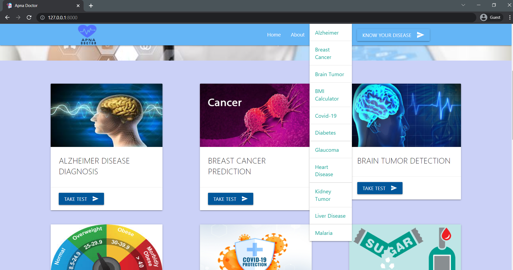

## Covid Prediction

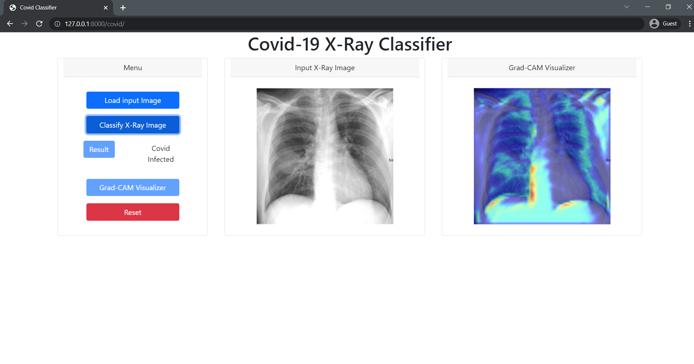

## Liver Form

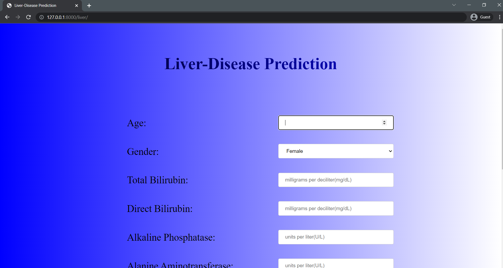

## Liver Form Result

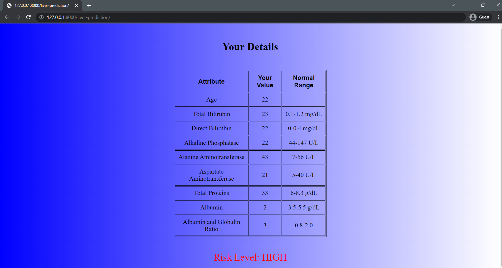

## Know Your Disease


## Know Your Disease Symptom

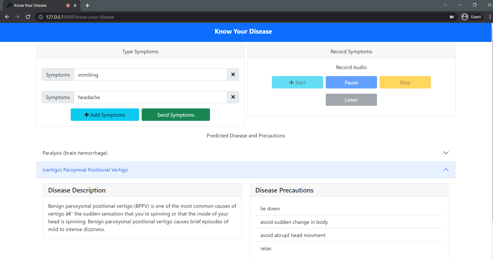

## Know Your Disease Audio

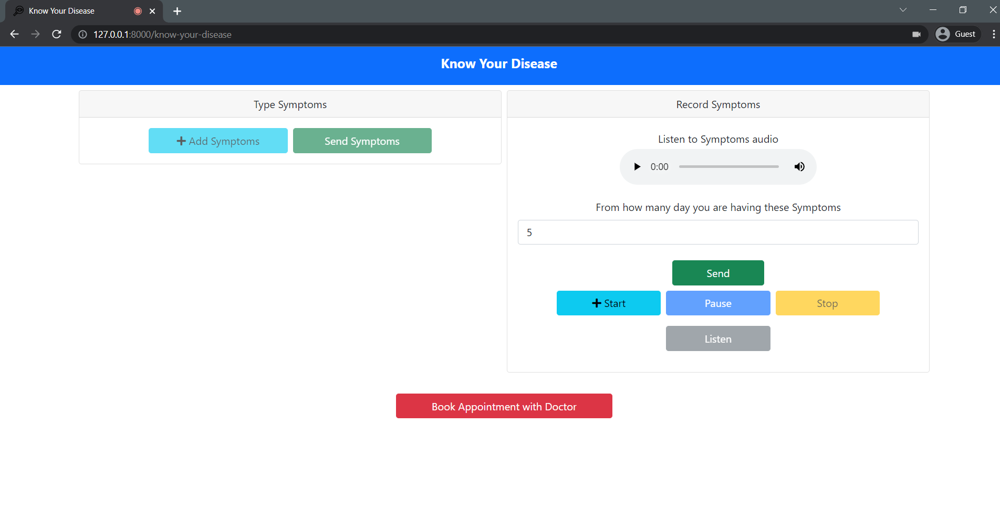

## Know Your Disease Symptom


## Registeration Page

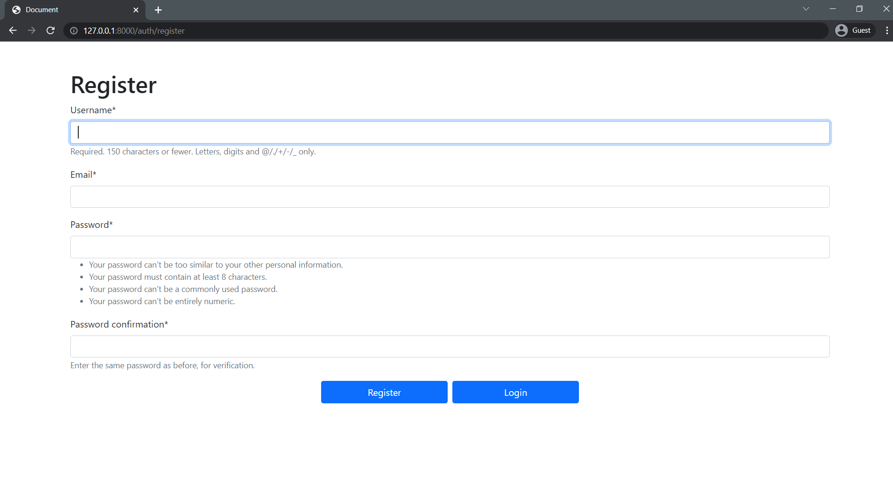

## Login Page

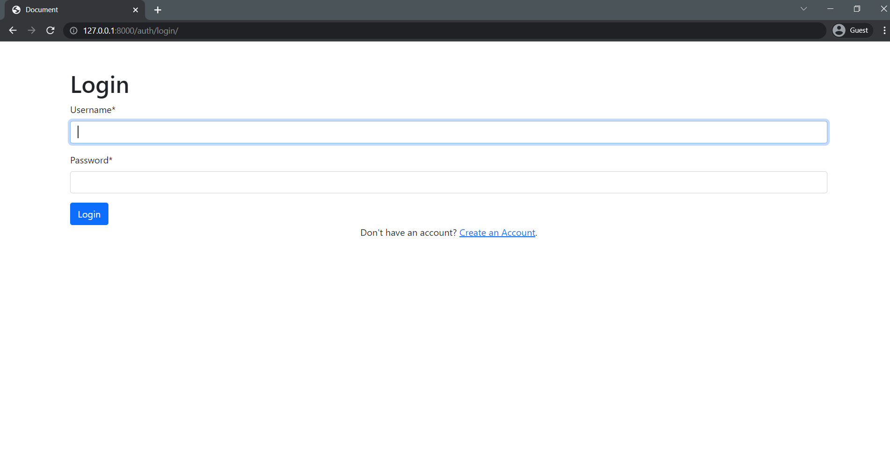

## Top 5 Doctors add to Database

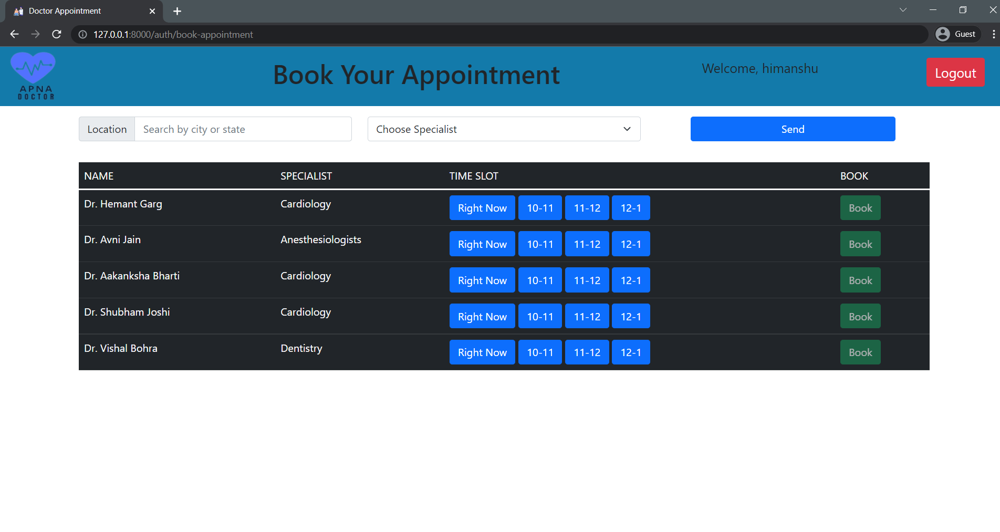

## Filtered Doctor


## Booking Time Slot


## Confirmation Mail

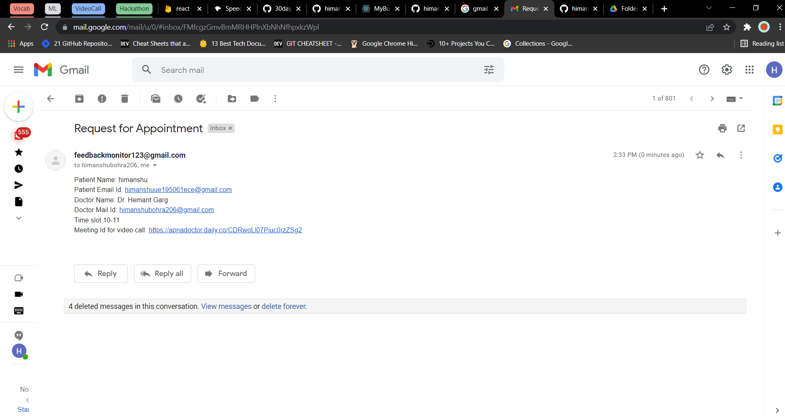

## Video Call

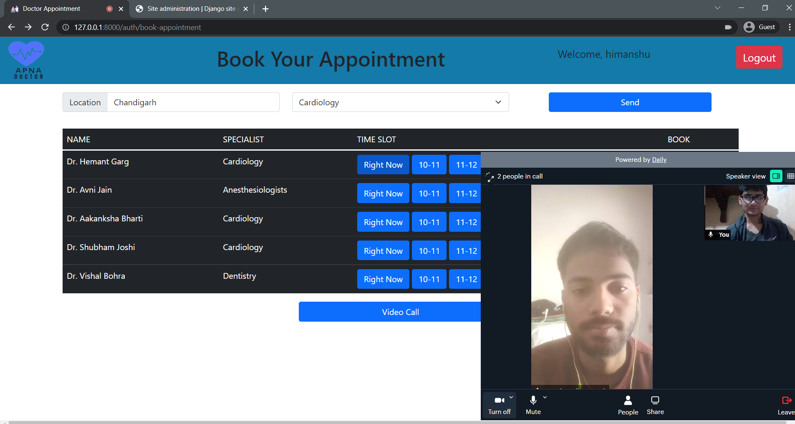
